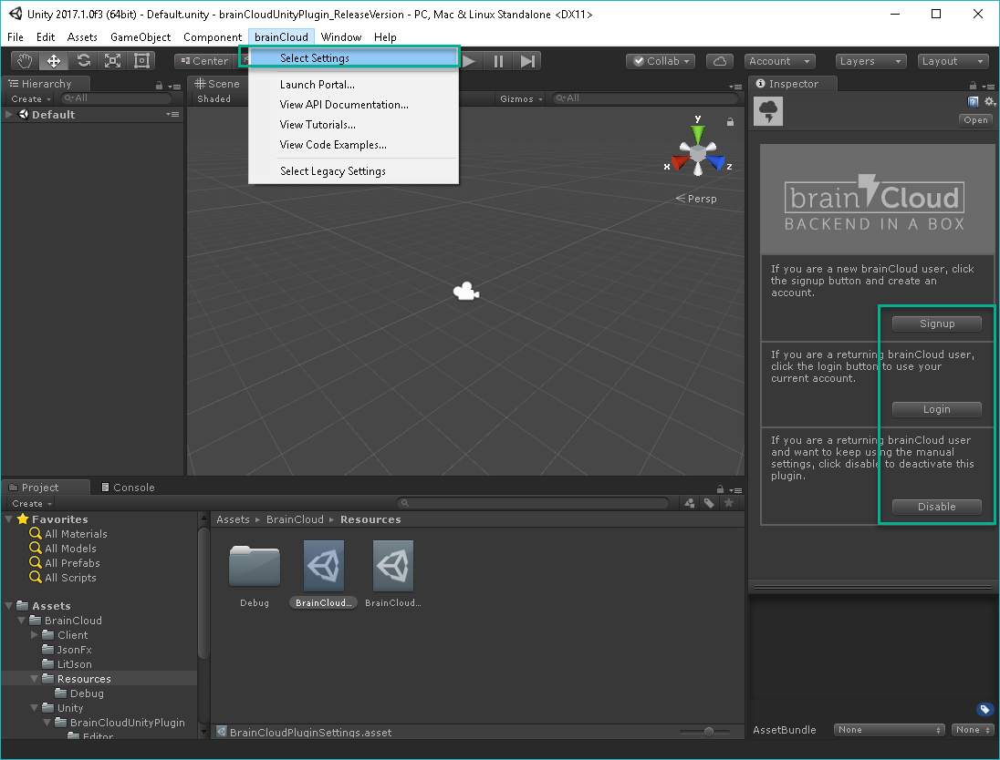
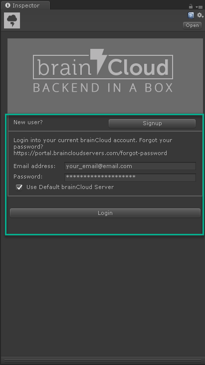
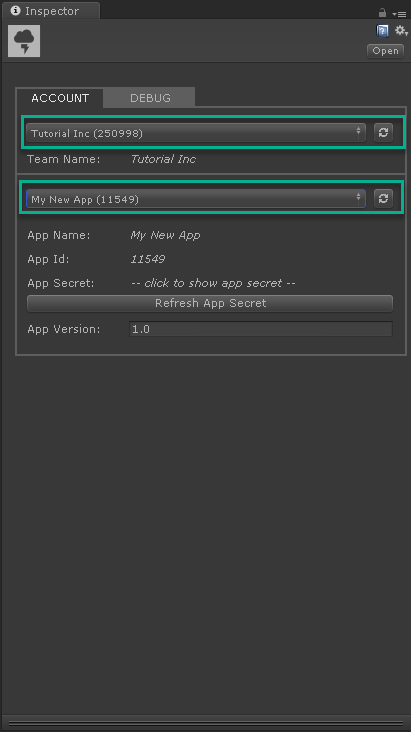
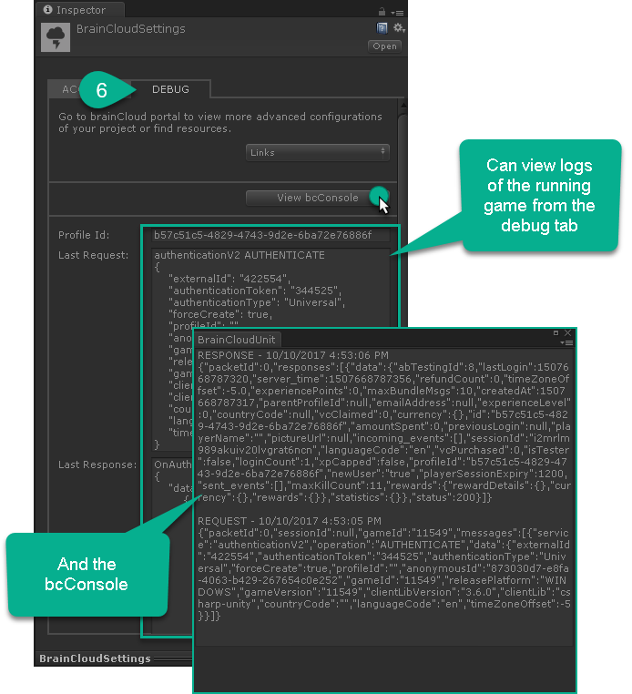

# brainCloud Unity/Csharp

Thanks for downloading the brainCloud Unity / C# client library! Here are a few notes to get you started. Further information about the brainCloud API and a few example Tutorials can be found here:

http://apidocs.braincloudservers.com/

If you haven't signed up or you want to log into the brainCloud portal, you can do that here:

https://portal.braincloudservers.com/

## Installation Guide

To install the brainCloud library simply copy these two folders into the Assets folder of your Unity project:

- BrainCloudClient/src/BrainCloud
- BrainCloudClient/src/Plugins

Once installed, you will need to configure a few settings from the brainCloud menu. If you don't see a brainCloud menu, click any menu bar entry to get Unity to refresh the list of menus.

- Open brainCloud | Select Settings

- Login or Signup to brainCloud. Click Disable to switch to Old System
	- If using old system, configure your Game Id and Game Secret to the values in the brainCloud Portal **Application Ids** section

- Select your team and your app

- With your app selected, debug information will now appear in the debug tab when the game is running

## First run
To check that everything is working, try running the default scene which is located here:

- BrainCloud/Unity/Scenes/Default.unity

You should see a dialog box asking for user/password. Enter anything you want here and you should get authenticated.

## Troubleshooting

Here are a few common errors that you may see on your first attempt to connect to brainCloud.

- **Game id not set**: Verify you've set up the game id and game secret correctly.
- **Platform not enabled**: Verify you've enabled your platform on the portal. If you're running from the Unity editor, you'll need to enable either **Windows** or **Mac OS**.

If you're still having issues, log into the portal and give us a shout through the help system (bottom right icon with the question mark and chat bubble).

